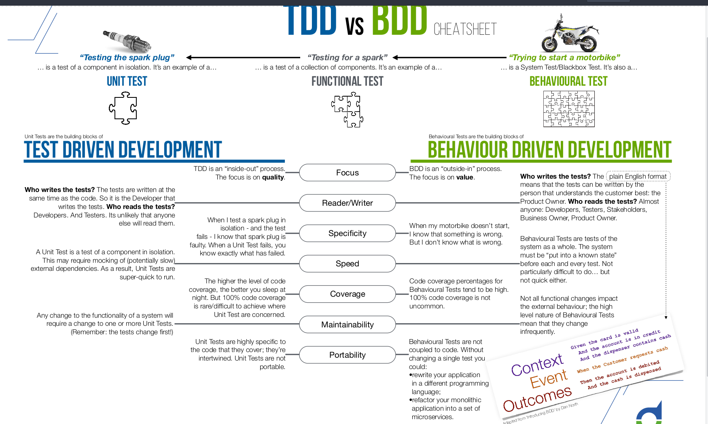

# Go Learning Path
## Go Fundamental
## 1. "Hello World" Basic type Variables, byte and rune and something funny in programing

### Basic type
bool

string

int int8 int16 int32 int64
Type 	Size 	Range
int8 	8 bits 	-128 to 127
int16 	16 bits 	-215 to 215 -1
int32 	32 bits 	-231 to 231 -1
int64 	64 bits 	-263 to 263 -1
int 	Platform dependent 	Platform dependent

uint uint8 uint16 uint32 uint64 uintptr

byte // alias for uint8

rune //alias for int32

float32 float64

complext64 complex128
https://golang.org/pkg/fmt/
### First go program

```go
package main
import "fmt"
func main() {
    fmt.Println("Hello, world!")
}
```
### Stack and Heap explain

```cmd
    Stack is used for static memory allocation and Heap for dynamic memory allocation, both stored in the computer's RAM.
    The stack is always reserved in a LIFO order, the most recently reserved block is always the next block to be freed. This makes it really simple to keep track of the stack, freeing a block from the stack is nothing more than adjusting one pointer.

    Variables allocated on the heap have their memory allocated at run time and accessing this memory is a bit slower, but the heap size is only limited by the size of virtual memory . Element of the heap have no dependencies with each other and can always be accessed randomly at any time. You can allocate a block at any time and free it at any time. This makes it much more complex to keep track of which parts of the heap are allocated or free at any given time.

```

### Variable declaretion defined

```go

package main

import "fmt"

func main() {
    //full declare and define
    var x string
    x = "Hello World"

    //declare and define in 1 line
    var y string = "Hello World"

    // combine 2 variable
    var i, j int = 1,2

    //Short variable declaration
    k := 3
    c, python, java := true, false, "no!"
    // However, outside a function, every statement begins with a keyword (var, func, and so on) and so the := construct is not available, and we'll get an error:

    fmt.Println(x, y, i, j, k, c, python, java)
    fmt.Printf("%T %T %T %T %T %T\n", i, j, k, c, python, java) //<-------------- %T type
}

```
### Global varibale and variable scope
First, one should discuss storage in terms of storage duration, the way C++ standard does: "stack" refers to automatic storage duration, while "heap" refers to dynamic storage duration. Both "stack" and "heap" are allocation strategies, commonly used to implement objects with their respective storage durations.
Global variables have static storage duration. They are stored in an area that is separate from both "heap" and "stack". Global constant objects are usually stored in "code" segment, while non-constant global objects are stored in the "data" segment.
```go
package main

import (
	"fmt"
	"math/cmplx"
)

var (
	ToBe   bool       = false
	MaxInt uint64     = 1<<64 - 1
	z      complex128 = cmplx.Sqrt(-5 + 12i)
)

func main() {
	fmt.Printf("Type: %T Value: %v\n", ToBe, ToBe)
	fmt.Printf("Type: %T Value: %v\n", MaxInt, MaxInt)
	fmt.Printf("Type: %T Value: %v\n", z, z)
}

```
### Zero value
 Variables declared without an explicit initial value are given their zero value.

The zero value is:

    0 for numeric types,
    false for the boolean type, and
    "" (the empty string) for strings.

```go
package main

import "fmt"

func main() {
	var i int
	var f float64
	var b bool
	var s string
	fmt.Printf("%v %v %v %q\n", i, f, b, s)
}
```

### Type conversion

    i := 42
    f := float64(i)
    u := uint(f)

```go
package main

import (
	"fmt"
	"math"
)

func main() {
	var x, y int = 3, 4
	var f float64 = math.Sqrt(float64(x*x + y*y))
	var z uint = uint(f)
	fmt.Println(x, y, z)
}
```

### Constants
    Constants are declared like variables, but with the const keyword.
    Constants can be character, string, boolean, or numeric values.
    Constants cannot be declared using the := syntax. 

```go
package main

import "fmt"

const Pi = 3.14

func main() {
	const World = "世界"
	fmt.Println("Hello", World)
	fmt.Println("Happy", Pi, "Day")

	const Truth = true
	fmt.Println("Go rules?", Truth)
}
```
## 2. TDD vs BDD (Test Driven vs Behavior Driven)
Inline-style: 


### Basic things enough to code meo cao chuot chay
### Function
```go
func add(x, y int) int {}
func (receiver) func_name(parameters) return_type{code}

package main

import "fmt"

//Normal function   
func add(x int, y int) int { //func add(x, y int) int {
	return x + y
}

//Multiple return value
func swap(x, y string) (string, string) {
	return y, x
}

//Named return value
func split(sum int) (x, y int) {
	x = sum * 4 / 9
	y = sum - x
	return
}

func main() {
    fmt.Println(add(42, 13))
    a, b := swap("hello", "world")
	fmt.Println(a, b)
}

```

### If else
```go
package main
 
import (
	"fmt"
)
 
func main() {
	x := 100
 
	if x == 50 {
		fmt.Println("Germany")
	} else if x == 100 {
		fmt.Println("Japan")
	} else {
		fmt.Println("Canada")
        }
        if x := 100; x == 100 {
		fmt.Println("Germany")
	}
}
```
### For
     Go has only one looping construct, the for loop. 

* The init statement: executed before the first iteration
* The condition expression: evaluated before every iteration
* The post statement: executed at the end of every iteration

```go
package main

import "fmt"

func main() {
	sum := 0
	for i := 0; i < 10; i++ {
		sum += i
    }
    for ; sum < 1000; {
		sum += sum
    }
    
	fmt.Println(sum)
}

```
### Go "While"
    Drop the semicolon for ---> while

```go
package main

import "fmt"

var alo int
func main() {
	alo = 100
	sum := 1
	for sum < 1000 {
		sum += sum
	}
	fmt.Println(alo,sum)
}
```

### Switch
```go
package main

import (
	"fmt"
	"time"
)

func main() {
	fmt.Println("When's Saturday?")
	today := time.Now().Weekday()
	switch time.Saturday {
	case today + 0:
		fmt.Println("Today.")
	case today + 1:
		fmt.Println("Tomorrow.")
	case today + 2:
		fmt.Println("In two days.")
	default:
		fmt.Println("Too far away.")
    }
    
    t := time.Now()
	switch {
	case t.Hour() < 12:
		fmt.Println("Good morning!")
	case t.Hour() < 17:
		fmt.Println("Good afternoon.")
	default:
		fmt.Println("Good evening.")
	}
}
```

## 3. "Hello World with Test, Packages, Go Doc"

- Basic code structurec
export GOPATH= **Current directory**
export PATH=$PATH:$GOPATH/bin

```cmd
.
├── bin # which	holds compiled	binary	executable	programs.
├── pkg # which	holds compiled	binary	package	files.
└── src
```
go get -u github.com/go-delve/delve/cmd/dlv

go get -u github.com/golangci/golangci-lint/cmd/golangci-lint

* Go has an opinioned formatter called go fmt. Your editor should be running this on every file save.
```cmd
go fmt
```

- Convention packages name:
Why package?
```go
Different programs same function
Sharing	code between programs using packages
```

$GOPATH/src/github.com{source location(internal, github, gityeahspace)}/chivt{username, user-id}/hello{package name}

Package name file
```cmd
Go tools use the name in the import path as the name of the directory to load the package source code from. If they don't match, the code won't load.
```

### Writing basic test
```
Writing a test is just like writing a function, with a few rules
It needs to be in a file with a name like xxx_test.go
The test function must start with the word Test
The test function takes one argument only t *testing.T
For now it's enough to know that your t of type *testing.T is your "hook" into the testing framework so you can do things like t.Fail() when you want to fail.
```
### Go doc
Add comment and type go doc inside the package

### Exercise
Create Calculation with ADD, SUBTRACT, MULTIPLY, DEVICE

## 3. "Arrays, Slices, Maps"
    ARRAYS is a list of values of particular type.
    An array holds a specific number of elements; no means are availble to easily add more elements to an array.
```go
//Declare, Define
var x [5]int -----> zero value [0 0 0 0 0]
//Set, Get element
x[4] = 100
//Insert
[0 0 0 0 100] or dung for
//Update
x[2] = 100 ----> [0 0 100 0 100]
//Delete
```

    SLICES also a list of elements of a particular type, but unlike arrays, tools are available to add or remove elements
    Slices don't hold any data themselves. A slice is merely a view into the elements of an underlying array.
```go
//Declare, Define
var x []float64 -------> The only difference between this and an array is the missing length between the brackets. In this case x has been created with a length of 0
x := make([]float64, 5)
x := make([]float64, 5, 10) -----> slice with 10 elements underlying array
//Set, Get element, //Insert, //Update
func main() {
  slice1 := []int{1,2,3}
  slice2 := append(slice1, 4, 5)
  fmt.Println(slice1, slice2)
}
func main() {
  slice1 := []int{1,2,3}
  slice2 := make([]int, 2)
  copy(slice2, slice1)
  fmt.Println(slice1, slice2)
}
```

    MAPS is a collection where each value is stored under a corresponding key.
    Whereas arrays and slices can only use integers as indexes, a map can use a any type for keys.
    All of a map's keys must be the same type, and all the values must be the same type, but the keys don't have to be the same type as the values.
```go
//Declare, Define
//Set, Get element
//Insert
//Update
//Delete
```

## 4. "Pointer, Struct, Types "

## 5. "Encapsulation, Method, Interfaces"

## 6. "Errors" and "Defer"

## 7. "Dependency Injection"

## 8. "Mocking"

## 9. "Concurrency"

## 10. "Select"

## 11. "Reflection"

## 12. "Sync"

## 13. "Context"

## 14. "Property based tests, Refactorism"

## 15. "Maths"

# Go Advanced
## 1. "HTTP server"
## 2. "JSON, routing, embedding"
## 3. "IO and sorting"
## 4. "Comandline & package structure"
## 5. "Time"
## 6. "WebSockets"
## 7. "Ginko" Framework
